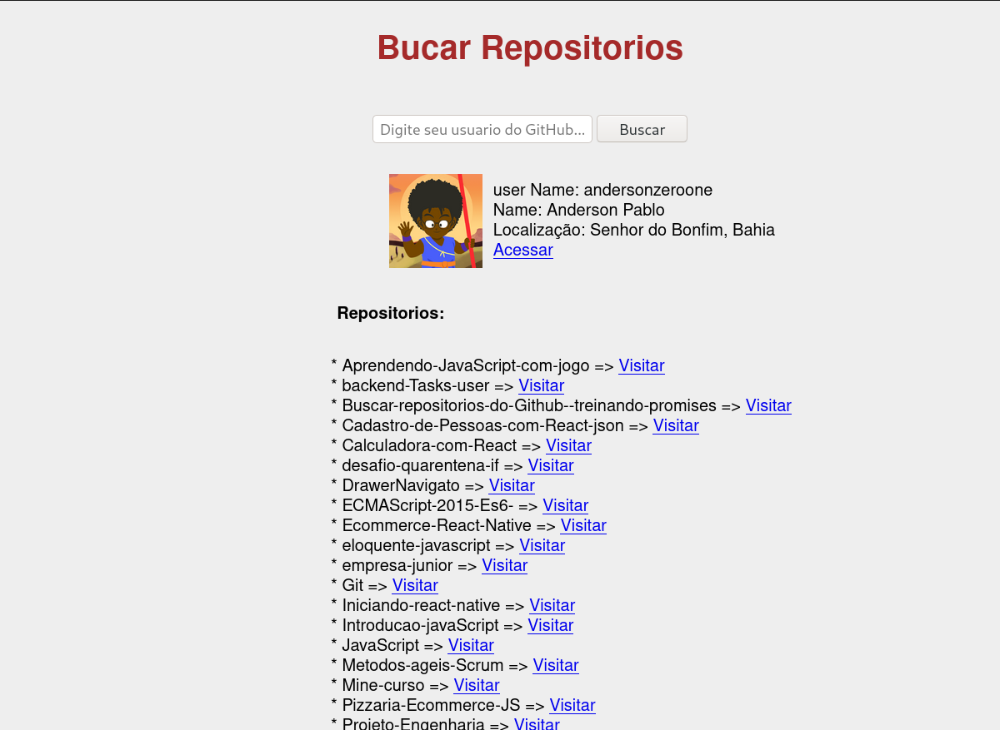

<h1 align="center">
  Buscar repositorios do Github - treinando promises
</h1>

----
<h4 align="center">
	🚧  treinando promises 🚀 em desenvolvimento 🚧
</h4>
<br/>

<p align="center">
 <a href="#sobre-o-projeto">Sobre o projeto</a> •
 <a href="#como-executar">Como executar</a> •
  <a href="#tecnologias">Tecnologias</a> •
<a href="#layout">Layout</a> •
 <a href="#sobre-promises">Sobre Promises</a> •
 <a href="#estados-de-uma-promise">Estados de uma Promise</a> •
  <a href="#métodos">Métodos</a> •
 <a href="#contribuidores">Contribuidores</a> •
 <a href="#autor">Autor</a> •
<a href="#licenc-a">Licença</a> •
</p>
<br/>

## Sobre o projeto
O projeto foi criado com o intuito de ver na prática o funcionamento das promises. O projeto consiste no consumo da api do GitHub para buscar os repositórios do usuário e informações assim como: imagem, nome e cidade. Além disso, permite visitar os repositórios ou página do usuário através de um link.

## Como executar
Para executar o projeto basta inicializar o arquivo "index.hmtl".


### Tecnologias

* [Promises](#sobre-promises);
* [XMLhttpRequest](#sobre-xmlhttprequest);
* [Api do Github.](https://developer.github.com/v3/).


## Layout

<p align="center" >
  
</p>

---

</br>

## Sobre Promises
A promise surgiu desde 2015 no ES6, a promise é utilizada pelas principais requisições http como, axios,APi Fetch entre outras. Facilmente identificada pelas callback .then e .catch, o .then retorna sucesso na requisição e recebe o resolve como parâmetro e o .catch para erros recebe o reject como parâmetro.

---
## Estados de uma Promise

Uma promise pode assumir quatro estados principais:
 
* Pending: O estado inicial da Promise, ela foi iniciada, mas ainda não foi realizada nem rejeitada;
 
* Fulfilled: Sucesso da operação, é o que chamamos de uma Promise realizada (ou, em inglês, resolved) — eu, pessoalmente, prefiro o termo resolvida;
 
* Rejected: Falha da operação, é o que chamamos de uma Promise rejeitada (em inglês, rejected);
 
* Settled: É o estado final da Promise, quando ela já sabe se foi resolved ou rejected.
 
Quando uma promise estiver em estado pendente (pending) pode se tornar uma promises resolvida com um valor, ou rejeitada (retornar um erro). Quando um dos casos acontecer o metodo .then será chamado e irá verificar se houve um sucesso(resolve) ou erro(reject).


---
## Métodos
#### Promise.all(lista)

Retorna uma promise que é resolvida quando todas as promises no argumento lista forem resolvidas ou rejeitada assim que uma das promises da lista for rejeitada. Se a promise retornada for resolvida, ela é resolvida com um array dos valores das promises resolvidas da lista. Se a promise for rejeitada, ela é rejeitada com o motivo da primeira promise que foi rejeitada na lista. Este método pode ser útil para agregar resultados de múltiplas promises.


```css
Promise.all([
  api.get('/users/andersonzeroone'),
  api.get('/repos/BuscarrepositoriosdoGithu'),
]).then([user, repo] => {
  console.log(user);
  console.log(repo);
});
```

#### Promise.race(lista)

Retorna uma promise que resolve ou rejeita assim que uma das promises do argumento lista resolve ou rejeita, com um valor ou o motivo daquela promise.


```css
const timeout = ms => new Promise((resolve, reject) => 
  setTimeout(reject, ms, { timeout: true });
);

Promise.race([api.get('/users/andersonzeroone'), timeout(2000)])
  .then(resp => console.log(resp))
  .catch(err => console.log(err));

```
#### Promise.reject(motivo)

Retorna um objeto Promise que foi rejeitado por um dado motivo.


```css
Promise.reject("Testando reject estático").then(function(motivo) {
  // não executado
}, function(motivo) {
  console.log(motivo); // "Testando reject estático"
});

Promise.reject(new Error("falha")).then(function(erro) {
  // não executado
}, function(erro) {
  console.log(erro); // Stacktrace
});
```
#### Promise.resolve(valor)

Retorna um objeto Promise que foi resolvido com um dado valor. Se o valor é thenable (possui um método then), a promise retornada "seguirá" este método, adotando esse estado eventual; caso contrário a promise retornada será realizada com o valor. Geralmente, se você quer saber se um valor é uma promise ou não, utilize Promise.resolve(valor) e trabalhe com a valor de retorno que é sempre uma promise.


```css
Promise.resolve("Success").then(function(value) {
  console.log(value); // "Success"
}, function(value) {
  // not called
});
```
### Encadeamento

Em alguns casos teremos uma Promise que retorna outra Promise e para acessar o resultado dessa segunda iremos precisar encadear as chamadas:

```css
promise1()
  .then(resp => resp.promise2())
  .then(resp2 => console.log(resp2));
```

A chamada da segunda Promise dentro do .thenda primeira, e encadeamos outro .then logo abaixo para tratar o resultado da segunda.


### Sobre XMLhttpRequest

XMLHttpRequest(XHR) são usados ​​para interagir com servidores. Você pode recuperar dados de um URL sem precisar atualizar a página inteira. Isso permite que uma página da Web atualize apenas parte de uma página sem interromper o que o usuário está fazendo. XMLHttpRequesté muito usado na programação AJAX .

Apesar do nome, XMLHttpRequestpode ser usado para recuperar qualquer tipo de dados, não apenas XML.

Se sua comunicação precisar envolver o recebimento de dados de eventos ou de mensagens de um servidor, considere o uso de eventos enviados pelo servidor por meio da EventSourceinterface. Para comunicação full-duplex, os WebSockets podem ser uma escolha melhor.


### Algumas propriedades:

 * XMLHttpRequest.onreadystatechange =>  Um EventHandlerque é chamado sempre que o readyStateatributo é alterado.

* XMLHttpRequest.readyState => Somente leitura
 Retorna um unsigned short, o estado da solicitação.

* XMLHttpRequest.status  => Somente leitura 
Retorna um unsigned shortcom o status da resposta da solicitação. 

---

</br>

### Métodos

* XMLHttpRequest.open()
  Inicializa uma solicitação.

* XMLHttpRequest.send()
Envia a solicitação. Se a solicitação for assíncrona (que é o padrão), esse método retornará assim que a solicitação for enviada.

---

</br>

#### Fontes:
* https://developer.mozilla.org/pt-BR/docs/Web/JavaScript/Guide/Usando_promises;

* https://developer.mozilla.org/en-US/docs/Web/API/XMLHttpRequest;

* https://medium.com/trainingcenter/entendendo-promises-de-uma-vez-por-todas-32442ec725c2;

* https://blog.rocketseat.com.br/javascript-assincrono-promises/;

* https://developer.github.com/v3/.

---

</br>

## Contribuidores

💜 Um super thanks 👏 para essa galera que fez esse produto sair do campo da ideia e entrar nas lojas de aplicativos :)

## Como contribuir para o projeto

1. Faça um **fork** do projeto.
2. Crie uma nova branch com as suas alterações: `git checkout -b my-feature`
3. Salve as alterações e crie uma mensagem de commit contando o que você fez: `git commit -m "feature: My new feature"`
4. Envie as suas alterações: `git push origin my-feature`
> Caso tenha alguma dúvida confira este [guia de como contribuir no GitHub](./CONTRIBUTING.md)

---

##  Autor
</br>

<a href="https://github.com/andersonzeroone">
 
 <br />
 <br />
 <sub><b>Anderson Pablo</b></sub></a> <a href="https://www.linkedin.com/in/anderson-pablo-js/" title="andersonPablo">🚀</a>
 <br />


 [](https://www.linkedin.com/in/anderson-pablo-js/)
[](mailto:anderson.pablo02@gmail.com)

---

## Licença

Este projeto está sob a licença [MIT](./LICENSE).

Feito com ❤️ por Anderson Pablo 👋🏽 [Entre em contato!](https://www.linkedin.com/in/anderson-pablo-js/)

---

<!-- ##  Versões do README

[Português 🇧🇷](./README.md)  |  [Inglês sem emojis 🇺🇸](./README-en.md) | [Portugues sem logo  🇧🇷](./README-sem-logo.md)  -->


